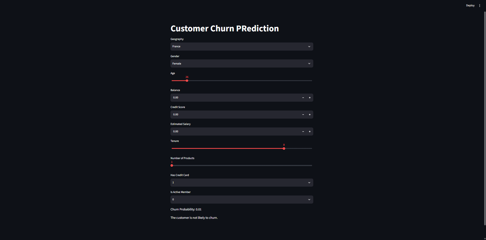

# Customer Churn Prediction

A Streamlit application that estimates a bank customer's probability of leaving, using a trained artificial neural network. Enter the customer's profile in the form to see a churn probability and a simple prediction at the 0.5 threshold.



## Run the app

Python and pip are required. From the project directory, create and activate a virtual environment, install the dependencies, and start Streamlit:

```powershell
python -m venv .venv
.venv\Scripts\Activate.ps1
python -m pip install --upgrade pip
pip install -r requirements.txt
streamlit run app.py
```

On macOS or Linux, activate the environment with `source .venv/bin/activate` instead. Streamlit prints a local URL (usually `http://localhost:8501`) when the app is ready.

Run `streamlit run app.py` from the project directory. The app loads its model and preprocessing files by relative path.

## Project files

- `app.py` - Streamlit interface and churn inference pipeline.
- `model.h5` - trained Keras neural network.
- `label_encoder_gender.pkl`, `onehot_encoder_geo.pkl`, `scaler.pkl` - preprocessing objects used when the model was trained.
- `Churn_Modelling.csv` - dataset used by the training experiments.
- `experiments.ipynb` - data preprocessing and ANN model training.
- `hyperparametertuningann.ipynb` - ANN hyperparameter tuning experiments.
- `prediction.ipynb` - example of preparing inputs and running model predictions.
- `salaryregression.ipynb` - additional regression notebook.
- `requirements.txt` - Python package dependencies.

Keep the model and all three preprocessing artifacts together with `app.py`; they must correspond to the same trained model. To retrain the model, run the relevant notebook cells that produce the model and preprocessing files before launching the app.

## Inputs

The app collects geography, gender, age, balance, credit score, estimated salary, tenure, number of products, credit-card status, and active-member status. Its output is a probability between 0 and 1, followed by a likely/not-likely message based on whether that value exceeds 0.5.

## License

This project is available under the MIT License. See [LICENSE](LICENSE).
